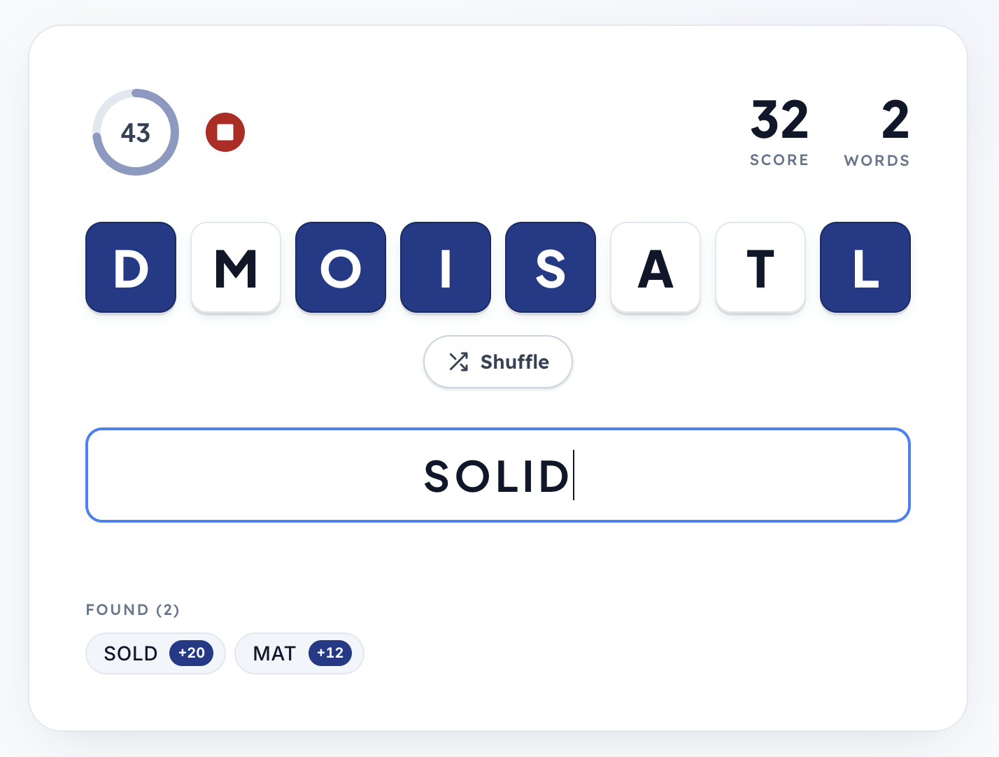

# Wordsmith

A 60-second word game: form as many words as you can from 8 randomly-supplied letters. Longer words score more; invalid words cost 15 points. Words using all 8 letters are always possible from the given set.

Live at <https://wordsmith-sparkling-feather-2886.fly.dev>.

## Screenshots





## Stack

- **Frontend** — React 19 + Vite + Tailwind v4, in `app/`
- **Backend** — Flask + SQLite (small leaderboard API), `server.py` at the repo root
- **Deploy** — single Fly.io app; the Flask process serves the built React bundle and the API on the same origin, so the SPA uses relative paths (`/submit-score`, `/leaderboard`)
- **Persistence** — SQLite database on a Fly volume mounted at `/data`

## Repo layout

```
app/                 # React + Vite frontend
  src/
    api.js           # leaderboard API client
    hooks/           # useGame, useDictionary, useLeaderboard
    components/      # screens and UI pieces
    game/            # game rules: scoring, letter sets, constants
server.py            # Flask app — API + SPA fallback
requirements.txt     # Python deps (flask, gunicorn)
Dockerfile           # two-stage build: Node builds the SPA, Python runs the server
fly.toml             # Fly.io app config
```

## Local development

The frontend talks to the backend via relative URLs, so you need both running.

**Backend:**
```sh
python3 -m venv .venv
source .venv/bin/activate
pip install -r requirements.txt
DB_PATH=./local.db gunicorn -b 0.0.0.0:8080 server:app
```

**Frontend (separate terminal):**
```sh
cd app
npm install
npm run dev
```

Vite proxies `/submit-score` and `/leaderboard` to `localhost:8080` — see `app/vite.config.js`.

## API

| Method | Path             | Body / Response                                                                 |
| ------ | ---------------- | ------------------------------------------------------------------------------- |
| GET    | `/leaderboard`   | Returns top 10 scores, ordered by score desc                                    |
| POST   | `/submit-score`  | `{ player_name, score, words_found, best_word }` → `{ ok: true }` (201)         |

## Deploying

Built and deployed via [Fly.io](https://fly.io):

```sh
fly deploy
```

First-time setup (already done for the live app — recorded here for reference):

```sh
fly launch --no-deploy                                     # create the Fly app
fly volumes create wordsmith_data --region sjc --size 1    # one-time persistent volume
fly deploy
```

Logs / monitoring:

```sh
fly logs
fly status
```
